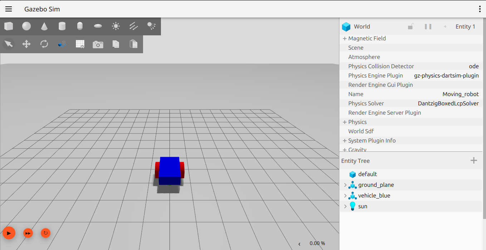

# ROS2 JAZZY

Trong hướng dẫn này sẽ thực hành những kiến thức cơ bản của ROS2 nhưng với hướng tiếp cận sâu hơn về robot, làm việc với robot.

## 1. Tạo work space

Mở terminal và nhập lệnh sau để tạo 1 workSpace
```bash
mkdir -p 01.work_space/20.ROS2_TRAINING/src
```
build
```bash
colcon build
```
khi này trong thư mục làm việc sẽ có các folder sau nhưng kệ nó
```bash
dev@Embedded:~/01.work_space/20.ROS2_TRAINING$ ls
build  install  log  src
```
kiểm tra phụ thuộc
```bash
rosdep install -i --from-path src --rosdistro jazzy -y
```
nếu trên terminal hiện lên dòng "#All required rosdeps installed successfully" là xong

## 2. Mô tả robot bằng sdf trong GAZEBO
Trước khi tìm hiểu xem ROS là cái gì, dùng làm gì thì ta sẽ học các mô phỏng robot của chính chúng ta trước
Trong thư mục src của workSpace đã tạo tạo ra 1 thư mục để chứa các file mô tả
```bash
mkdir -p  01.gz_sim/meshes
```
```bash
cd 01.gz_sim/
```
Tạo file mô tả:
```bash
touch myrobot.sdf
```
truy cập vào đường link sau và copy code trong đó paste vào trong file myrobot.sdf

```bash
https://github.com/Lam-Embedded/Gazebo-2-wheel-differential-robot-simulator/blob/main/building_robot.sdf
```
Sau khi paste xong thì thử chạy mô phỏng trong gazebo xem hình dạng của robot thế nào:
Mở terminal vào trong thư mục chứa file myrobot.sdf
```bash
cd 01.work_space/20.ROS2_TRAINING/src/01.gz_sim/
```
chạy lệnh sau để mô phỏng:
```bash
gz sim myrobot.sdf
```
Đây sẽ là mô hình robot 2 bánh vi sai đơn giản của chúng ta:


Trong đó cấu trúc cơ bản của 1 file sdf mô tả robot như sau:
```bash
<?xml version="1.0" ?>
<sdf version="1.8">
    <world name="Moving_robot">
    ...
    ...
    </world>
</sdf>
```
Mọi thứ sẽ được viết bên trong thẻ <world> </world>
Trước tiên là tạo 1 thế giới cơ bản


